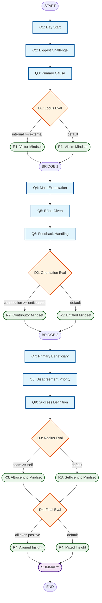

```mermaid
graph TD
    %% Node Definitions
    START([START])
    
    %% AXIS 1
    Q1_AXIS1[Q1: Day Start]
    Q2_AXIS1[Q2: Biggest Challenge]
    Q3_AXIS1[Q3: Primary Cause]
    D1_AXIS1{D1: Locus Eval}
    R1_INTERNAL([R1: Victor Mindset])
    R1_EXTERNAL([R1: Victim Mindset])
    BRIDGE_1([BRIDGE 1])

    %% AXIS 2
    Q4_AXIS2[Q4: Main Expectation]
    Q5_AXIS2[Q5: Effort Given]
    Q6_AXIS2[Q6: Feedback Handling]
    D2_AXIS2{D2: Orientation Eval}
    R2_CONTRIB([R2: Contributor Mindset])
    R2_ENTITLED([R2: Entitled Mindset])
    BRIDGE_2([BRIDGE 2])

    %% AXIS 3
    Q7_AXIS3[Q7: Primary Beneficiary]
    Q8_AXIS3[Q8: Disagreement Priority]
    Q9_AXIS3[Q9: Success Definition]
    D3_AXIS3{D3: Radius Eval}
    R3_TEAM([R3: Altrocentric Mindset])
    R3_SELF([R3: Self-centric Mindset])
    
    %% CONCLUSION
    D4_PRE_SUMMARY{D4: Final Eval}
    R4_FINAL_INSIGHT_A([R4: Aligned Insight])
    R4_FINAL_INSIGHT_B([R4: Mixed Insight])
    SUMMARY([SUMMARY])
    END_NODE([END])

    %% Axis 1 Flow
    START --> Q1_AXIS1
    Q1_AXIS1 --> Q2_AXIS1
    Q2_AXIS1 --> Q3_AXIS1
    Q3_AXIS1 --> D1_AXIS1
    
    D1_AXIS1 -- "internal >= external" --> R1_INTERNAL
    D1_AXIS1 -- "default" --> R1_EXTERNAL
    
    R1_INTERNAL --> BRIDGE_1
    R1_EXTERNAL --> BRIDGE_1

    %% Axis 2 Flow
    BRIDGE_1 --> Q4_AXIS2
    Q4_AXIS2 --> Q5_AXIS2
    Q5_AXIS2 --> Q6_AXIS2
    Q6_AXIS2 --> D2_AXIS2
    
    D2_AXIS2 -- "contribution >= entitlement" --> R2_CONTRIB
    D2_AXIS2 -- "default" --> R2_ENTITLED
    
    R2_CONTRIB --> BRIDGE_2
    R2_ENTITLED --> BRIDGE_2

    %% Axis 3 Flow
    BRIDGE_2 --> Q7_AXIS3
    Q7_AXIS3 --> Q8_AXIS3
    Q8_AXIS3 --> Q9_AXIS3
    Q9_AXIS3 --> D3_AXIS3
    
    D3_AXIS3 -- "team >= self" --> R3_TEAM
    D3_AXIS3 -- "default" --> R3_SELF
    
    R3_TEAM --> D4_PRE_SUMMARY
    R3_SELF --> D4_PRE_SUMMARY
    
    %% Conclusion Flow
    D4_PRE_SUMMARY -- "all axes positive" --> R4_FINAL_INSIGHT_A
    D4_PRE_SUMMARY -- "default" --> R4_FINAL_INSIGHT_B
    
    R4_FINAL_INSIGHT_A --> SUMMARY
    R4_FINAL_INSIGHT_B --> SUMMARY
    
    SUMMARY --> END_NODE

    %% Styling
    classDef question fill:#e1f5fe,stroke:#01579b,stroke-width:2px;
    classDef decision fill:#fff3e0,stroke:#e65100,stroke-width:2px;
    classDef reflection fill:#e8f5e9,stroke:#1b5e20,stroke-width:2px;
    classDef summary fill:#f3e5f5,stroke:#4a148c,stroke-width:2px;

    class Q1_AXIS1,Q2_AXIS1,Q3_AXIS1,Q4_AXIS2,Q5_AXIS2,Q6_AXIS2,Q7_AXIS3,Q8_AXIS3,Q9_AXIS3 question;
    class D1_AXIS1,D2_AXIS2,D3_AXIS3,D4_PRE_SUMMARY decision;
    class R1_INTERNAL,R1_EXTERNAL,R2_CONTRIB,R2_ENTITLED,R3_TEAM,R3_SELF,R4_FINAL_INSIGHT_A,R4_FINAL_INSIGHT_B reflection;
    class SUMMARY summary;
```
